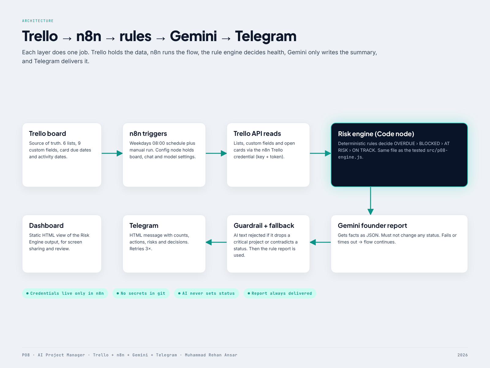

# P08 — AI Project Manager (Trello + n8n + AI)

Reads every project card on a Trello board, decides each project's health with **deterministic rules**, has **Gemini** write a short founder report from those facts, and sends it on **Telegram** every weekday at 08:00. If Gemini fails or contradicts the rules, the rule-based report is sent instead.

```
Trello (source of truth) → n8n (orchestration) → Risk Engine (rules decide health)
        → Gemini (writes summary only) → Guardrail → Telegram (founder notification)
```



## What it does

| Layer | Role | Where |
|---|---|---|
| Trello | Lists = status, card due date = deadline, 9 custom fields | `docs/TRELLO-SETUP.md` |
| n8n | Schedule + manual trigger, Trello API reads, Code nodes, Gemini call, Telegram | `n8n/p08-ai-project-manager.workflow.json` |
| Risk engine | OVERDUE › BLOCKED › AT RISK › ON TRACK + 9 signals | `src/p08-engine.js` |
| Gemini | Turns computed facts into ≤170-word founder note; cannot change status | Gemini node + `buildAiPrompt()` |
| Guardrail | Rejects AI text that omits a critical project or contradicts a status | `validateAiReport()` |
| Telegram | HTML message: counts, act-now, at-risk, decisions | Telegram node |
| Dashboard | Static HTML view of the same engine output | `dashboard/index.html` |

## Rules (health is never decided by AI)

| Signal | Rule | Severity |
|---|---|---|
| OVERDUE | Deadline before today, card not in Done | critical |
| BLOCKED | Blocker field set, or card in Blocked list | critical |
| Due soon, not started | Deadline ≤ 7 days, still in Backlog / To Do | high |
| Dependency at risk | Depends on an OVERDUE or BLOCKED card | high |
| Dependency late / not found | Dependency due after this deadline, or name not on board | high |
| Hours over estimate | Actual > Estimated (high above +20%) | medium/high |
| Missing update | No card activity > 7 days (high > 14) | medium/high |
| Missing fields | Owner, Deadline, Priority or Estimated Hours empty | medium |
| Owner reported high risk | Risk Level = High | medium |

Precedence: OVERDUE › BLOCKED › AT RISK (any signal) › ON TRACK. Done cards are excluded. Thresholds are configurable (`DEFAULT_CONFIG`).

## Quick start

```bash
npm test                         # 22 engine tests, no dependencies
npm run build:workflow           # regenerate the n8n JSON from src/p08-engine.js
```

Deploy: follow `docs/N8N-SETUP.md` (import workflow, create 3 credentials, set Config node). Trello board: `docs/TRELLO-SETUP.md`.

Local test run without a Trello account: `npm run mock:trello`, then set `Config.trelloBaseUrl = http://127.0.0.1:4010` and `trelloBoardId = b08000000000000000000001`.

## Repository layout

```
src/p08-engine.js            deterministic engine (single source of truth)
n8n/*.workflow.json          importable n8n workflow (generated, engine embedded)
scripts/                     build-workflow, make-fixture, trello-setup, mock servers, build-dashboard
fixtures/                    seed projects + Trello-API-shaped board
test/engine.test.js          node:test suite
dashboard/                   static dashboard
evidence/                    real n8n run output, captures, test output
portfolio/                   cover, architecture, screenshots, PDFs, video, build script
docs/                        architecture, Trello setup, n8n setup, cloud environment notes
```

## Status

See `TEST-RESULTS.md`. Verified: engine tests, full n8n execution, real Telegram delivery, all three AI report paths. **Not verified in the build environment:** a live Trello board and a live Gemini response (see `docs/CLOUD-ENVIRONMENT.md`).
