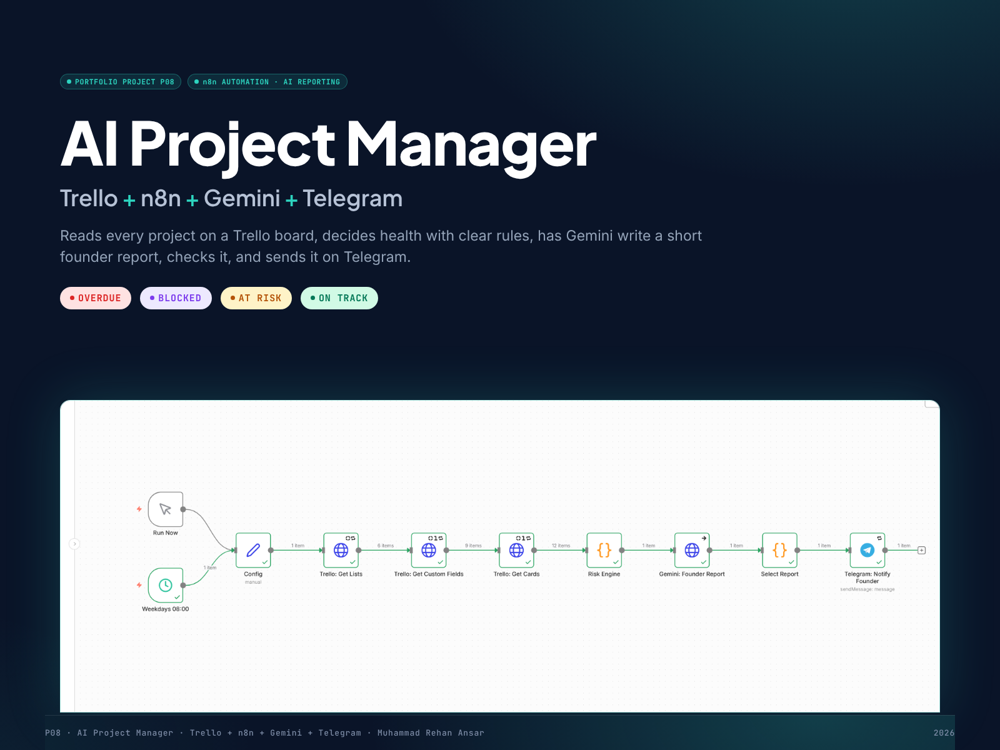

# P08 — AI Project Manager (Trello + n8n + Gemini + Telegram)

An n8n workflow that reads every project on a Trello board, decides its health with **deterministic rules**, asks **Gemini** for a short founder report, **validates** that report against the rules, and sends it on **Telegram** every weekday at 08:00. If Gemini fails or contradicts the rules, the rule-based report is sent instead.



```
Trello → n8n → Deterministic Rule Engine → Gemini → AI Validation → Telegram
                                              └── failure / invalid ──→ Rule-based report → Telegram
```

## Package contents

| Folder / file | What it is |
|---|---|
| `workflow/` | Importable n8n workflow (generated from `src/`, credentials referenced by name only) |
| `src/p08-engine.js` | Rule engine, report builder, AI prompt, AI validation, Telegram formatter (no dependencies) |
| `tests/` | 34 automated tests incl. the 12 acceptance scenarios (`npm test`) |
| `scripts/` | Workflow builder, Trello setup, test environment (n8n harness, Trello/Gemini stand-ins), recorder, media builders |
| `fixtures/` | 12-project test board (readable seed + Trello API format) |
| `dashboard/` | Static dashboard of the run |
| `trello-view/` | Board view rendered from the Trello API data |
| `evidence/` | Raw n8n run results, live execution frames + recording, captures, test output |
| `screenshots/` | 12 portfolio screenshots, 1600×1200 |
| `video/` | 60 s, 1920×1080 video with voice-over and original music (+ audio sources) |
| `case-study/` | A4 case study PDF |
| `presentation/` | 16:9 presentation PDF, 13 slides |
| `architecture/` | Architecture diagram |
| `cover/` | Portfolio cover |
| `docs/` | `HOW-TO.md` (setup and use), `ARCHITECTURE.md`, `TEST-ENVIRONMENT.md` |
| `TEST-RESULTS.md` · `UPWORK-PORTFOLIO-ENTRY.md` · `MEDIA-LICENSES.md` | Results, portfolio text, media record |
| `P08-AI-Project-Manager-FINAL.zip` | Everything above in one file |

## Health rules

| Signal | Rule | Severity |
|---|---|---|
| OVERDUE | Deadline before today, card not in Done | critical |
| BLOCKED | Blocker field set, or card in Blocked list | critical |
| Due soon, not started | Deadline ≤ 7 days, still in Backlog / To Do | high |
| Dependency at risk | Depends on an OVERDUE or BLOCKED card | high |
| Dependency late / not found | Dependency due after this deadline, or name not on board | high |
| Hours over estimate | Actual > Estimated (high above +20%) | medium/high |
| Missing update | No card activity > 7 days (high > 14) | medium/high |
| Missing required data | Owner, Deadline, Priority or Estimated Hours empty | medium |
| Owner reported high risk | Risk Level = High | medium |

Precedence: OVERDUE › BLOCKED › AT RISK › ON TRACK.

## Quick start

```bash
npm test                    # 34 tests, no dependencies
npm run build:workflow      # regenerate workflow/ from src/
```

Setup on n8n with live Trello, Gemini and Telegram: **`docs/HOW-TO.md`**.

## Status

All 12 scenarios pass. The workflow was executed end to end in n8n 1.123 for all three report paths, with live Telegram delivery. Trello and Gemini were served by local stand-ins in those runs (see `docs/TEST-ENVIRONMENT.md`); connecting live accounts needs only the n8n credentials.
