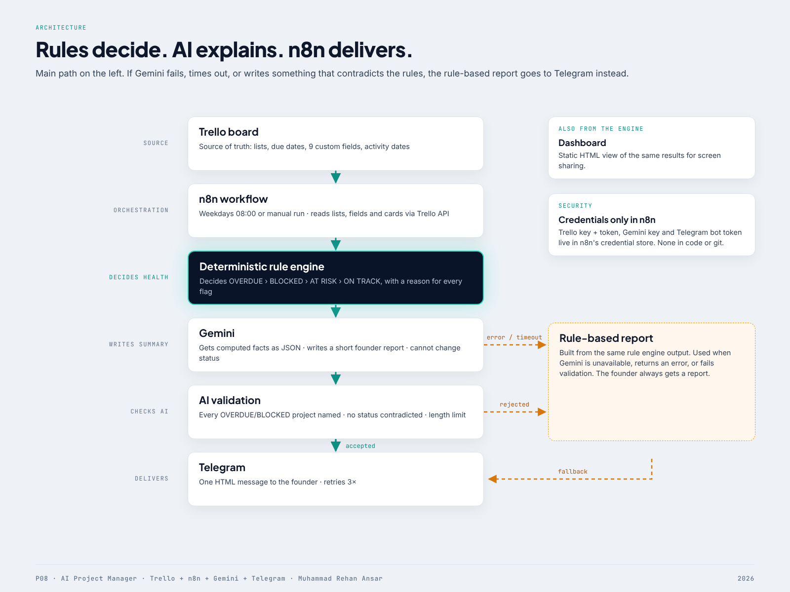

# Architecture

## Flow (n8n, 10 nodes)

1. **Run Now** (manual) / **Weekdays 08:00** (cron `0 8 * * 1-5`, workflow timezone Asia/Riyadh)
2. **Config** — `trelloBaseUrl`, `trelloBoardId`, `telegramChatId`, `geminiBaseUrl`, `geminiModel`, `aiEnabled`, `aiLabel`, `timezone`, `asOfOverride`
3. **Trello: Get Lists** → `GET /1/boards/{id}/lists`
4. **Trello: Get Custom Fields** → `GET /1/boards/{id}/customFields` (execute once)
5. **Trello: Get Cards** → `GET /1/boards/{id}/cards/open?customFieldItems=true` (execute once)
   - All three use the n8n **Trello API** credential (key + token as query params), 3 retries, 30 s timeout, `alwaysOutputData` so an empty board still produces a report.
6. **Risk Engine** (Code) — checks Config, then `fromTrello()` → `evaluate()` → `buildRuleReport()` + `buildAiPrompt()`
7. **Gemini: Founder Report** (HTTP) — `POST /v1beta/models/{model}:generateContent`, Header Auth credential (`x-goog-api-key`), temperature 0.2, 30 s timeout, **On Error: continue**
8. **Select Report** (Code) — `selectReport()`: uses the Gemini text only if `validateAiReport()` passes; otherwise the rule report. Records `source` and `reason`.
9. **Telegram: Notify Founder** — `buildTelegramMessage()` output, HTML parse mode, no n8n attribution, 3 retries.

## Design decisions

**Rules decide, AI writes.** LLM classifications are not repeatable or auditable. Health is computed by pure functions with fixed precedence; the same input always gives the same output (tested). Gemini receives the computed facts as JSON and is told not to change any status.

**Guardrail on AI output.** Rejected if empty, > 2500 chars, missing any OVERDUE/BLOCKED project by name, or describing a non-healthy project as "on track". The founder always gets a report.

**One engine, two runtimes.** `src/p08-engine.js` has no dependencies. `scripts/build-workflow.js` embeds it verbatim in both Code nodes, so n8n runs exactly the tested code. Edit the source, run `npm run build:workflow`, re-import.

**Credentials only in n8n.** The workflow JSON references credentials by name (`P08 Trello API`, `P08 Gemini API Key`, `P08 Telegram Bot`). No key, token or chat ID is committed.

**Only n8n talks to Trello and Gemini.** Trello needs two values per request (API key + token); n8n's Trello credential stores both. No other component needs any credential. See `TEST-ENVIRONMENT.md` for how this was tested.

## Data contract (normalized project)

`project, owner, status (list name), priority, deadline, estimatedHours, actualHours, blocker, dependency (card name), riskLevel, nextMilestone, decisionRequired, lastActivity`

Engine output per project adds `health`, `flags[] {code, severity, message}`, `daysToDeadline`, `daysSinceUpdate`, `score` (sort key).
